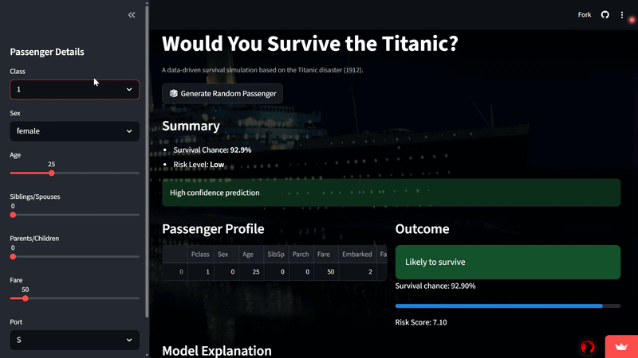

# Titanic Survival Simulator

An interactive machine learning web app that predicts whether a passenger would survive the Titanic disaster based on historical data. The app allows users to simulate different passenger profiles and understand how various factors influence survival probability.

---

## Live Demo

https://titanic-survival-simulator.streamlit.app/

---

## Features

* Real-time survival prediction using Logistic Regression
* Interactive passenger simulation (age, class, gender, etc.)
* Survival probability with risk level indicator
* SHAP-based model explainability
* Alternate scenario comparison (what-if analysis)
* Random passenger generator
* Clean and modern UI

---

## How It Works

The model is trained on the Titanic dataset and uses key features such as:

* Passenger Class
* Gender
* Age
* Fare
* Family Size
* Embarkation Port

The Logistic Regression model calculates survival probability, while SHAP explains how each feature contributes to the prediction.

---

## Tech Stack

* Python
* Streamlit
* Pandas
* Scikit-learn
* Matplotlib
* SHAP

---

## Model Details

* Model: Logistic Regression
* Type: Binary Classification
* Output: Survival Probability (0–100%)
* Evaluation Metric: Accuracy

The model is chosen for its simplicity, interpretability, and effectiveness on structured data.

---

## Key Insight

Passengers with higher class, female gender, and higher fare had better survival chances. Family size and age also influenced outcomes.

---

## About the Creator

**Arnav Singh**  
Machine Learning Enthusiast | Aspiring Data Scientist  

### Email: itsarnav.singh80@gmail.com  
### LinkedIn: https://www.linkedin.com/in/arnav-singh-a87847351  
### GitHub: https://github.com/Arnav-Singh-5080  

---

## License

This project is for educational and demonstration purposes.
